<!-- ╔══════════════════════════════════════════════════════════════╗
     ║  UMAR FAIZER — GitHub Profile README v1.0                   ║
     ║  Software Developer | Python · Java · C# · MySQL · Dart     ║
     ╚══════════════════════════════════════════════════════════════╝ -->

<!-- ═══════════════════════ HEADER ═══════════════════════ -->


<!-- ═══════════════════════ 3D CUBE + IDENTITY ═══════════════════════ -->
<table align="center"><tr>
<td width="240" valign="middle">


</td>
<td valign="middle">


<br/><br/>

[](https://github.com/faizerumar)


</td>
</tr></table>

---

<!-- ═══════════════════════ WHOAMI — YAML CONFIG ═══════════════════════ -->
## 🧬 `$ cat /etc/umar.yaml`

```yaml
# ─────────────────────────────────────────────────────────────────
# /etc/umar.yaml — Software Developer Identity Config
# Status: ACTIVE
# ─────────────────────────────────────────────────────────────────

identity:
  name: Umar Faizer
  role: Software Developer
  github: faizerumar

professional_stack:
  languages:    [ Python, Java, C#, Dart ]
  databases:    [ MySQL ]
  web:          [ HTML, CSS, JavaScript ]
  ide:          [ Apache NetBeans, VS Code ]
  version_ctrl: [ Git ]

philosophy: "Build things that actually work."
```

---

<!-- ═══════════════════════ CI/CD PIPELINE ═══════════════════════ -->
## ⚙️ `$ describe pipeline umar-dev-workflow`



---

<!-- ═══════════════════════ PROJECTS AS docker ps ═══════════════════════ -->
## 🚢 `$ list projects`

```bash
PROJECT NAME                STACK                    STATUS          LINK
──────────────────────────────────────────────────────────────────────────────
expense-tracker             HTML/CSS/JS + MySQL       Up               → github.com/faizerumar/expense-tracker
smart-inventory-system      Java + NetBeans (AI)      Up               → github.com/faizerumar/Smart-Inventory-System-AI-Powered
──────────────────────────────────────────────────────────────────────────────
```

### 💰 Expense Tracker
Web application for tracking personal expenses, built with **HTML, CSS, JavaScript, Python and MySQL**.
🔗 [github.com/faizerumar/expense-tracker](https://github.com/faizerumar/expense-tracker)

### 📦 Smart Inventory System (AI-Powered)
An AI-powered, enterprise-grade **Java** web application that automates stock management, streamlines supply chains, and optimizes warehouse operations. Built natively using **Apache NetBeans**, it provides real-time tracking, automated reorder triggers, and smart insights to eliminate stockouts and overstocking.
🔗 [github.com/faizerumar/Smart-Inventory-System-AI-Powered](https://github.com/faizerumar/Smart-Inventory-System-AI-Powered)

---

<!-- ═══════════════════════ GITHUB STATS ═══════════════════════ -->
## 📊 `$ stats`

<div align="center">


&nbsp;


</div>

<div align="center">

</div>

---

<!-- ═══════════════════════ ACTIVITY GRAPH ═══════════════════════ -->
## 📈 `$ git log --graph --all`

<div align="center">

</div>

---

<!-- ═══════════════════════ CONTRIBUTION SNAKE ═══════════════════════ -->
## 🐍 `$ git commit --all`

<div align="center">

</div>

---

<!-- ═══════════════════════ CONNECT ═══════════════════════ -->
## 🤝 `$ connect`

<div align="center">

[](https://github.com/faizerumar)

</div>

<div align="center">

> *"Build things that actually work."*

</div>


